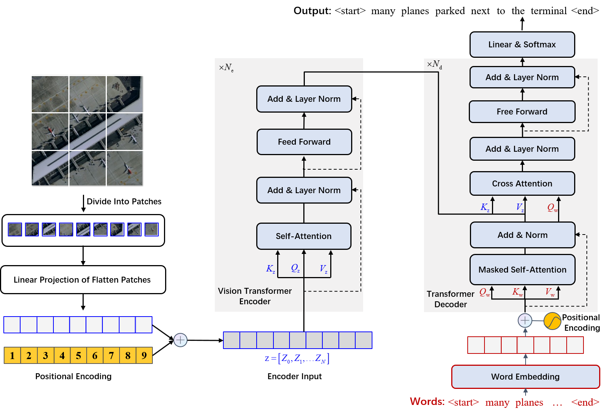
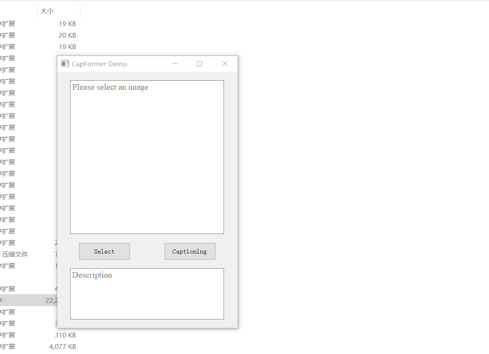

<h2 align="center">CapFormer: Pure transformer for remote sensing image caption</h2>


<h5 align="right">by <a href="https://junjue-wang.github.io/homepage/">Junjue Wang</a>, <a href="https://github.com/DH-boy">Zihang Chen</a>, 
Ailong Ma, Yanfei Zhong
</h5>

[[`Demo`](https://pan.baidu.com/s/19ic1Kz6RYFLwML-EEj-PyA?pwd=2333)]


This is an demo for our coming IGARSS 2022 paper (Student Paper Contest Top10).
---------------------
#### Using Examples


#### Download Demo exe
The executable program is released [here](https://pan.baidu.com/s/19ic1Kz6RYFLwML-EEj-PyA?pwd=2333).
Unzip and click to run `CapFormer.exe`.
You can find some samples in [`inputs`](./inputs) folder.
Or you can upload your own images to have fun.
The RSICD dataset can be used [here](https://github.com/201528014227051/RSICD_optimal).

## Citation
If you use CapFormer in your research, please cite our coming IGARSS 2022 paper.
```text
    @INPROCEEDINGS{CapFormer,
    title = {CapFormer: Pure transformer for remote sensing image caption},
    booktitle = {2022 IEEE International Geoscience and Remote Sensing Symposium IGARSS},
    year={2022},
    volume={},
    number={},
    pages={},
    doi={},
    author = {Junjue Wang and Zihang Chen and Ailong Ma and Yanfei Zhong},
    }
```
CapFormer can be used for academic purposes only,
<font color="red"><b> and any commercial use is prohibited.</b></font>
<a rel="license" href="https://creativecommons.org/licenses/by-nc-sa/4.0/deed.en">

</a>